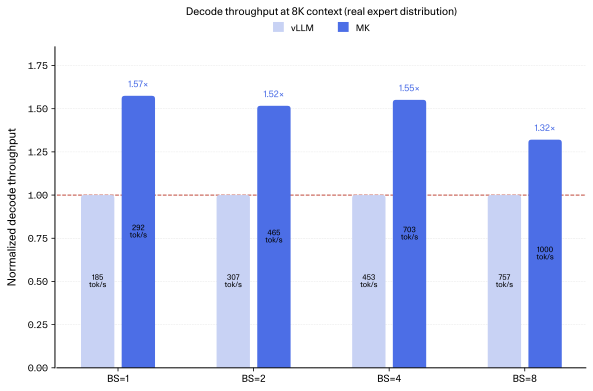
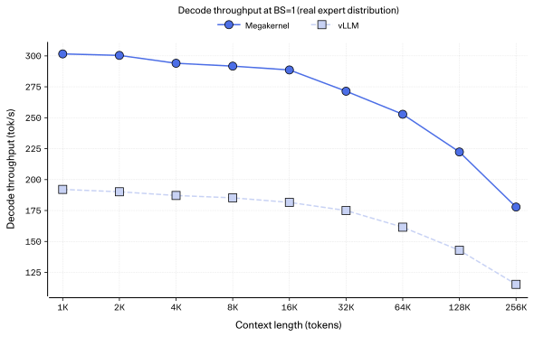
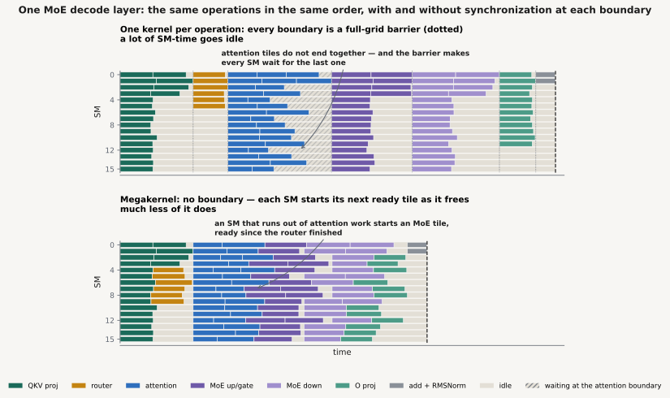

# Megakernel Serving Engine for North Mini Code

**A fully-fledged serving system built around a decode megakernel —
62% of H100 speed-of-light at batch size 1, 1.25×–1.41× faster than vLLM v0.24
end-to-end.**

A research release of a single-H100 inference engine that serves
North Mini Code with a persistent decode megakernel, behind an
OpenAI-compatible API.

Read the blog post (coming soon) for the full design story.

> [!IMPORTANT]
> This is an early research release, not a general-purpose inference engine.
> Tested on: single NVIDIA H100 (`sm_90a`), CUDA 13+, CPython 3.12+, Linux,
> batch sizes up to 8. Other configurations are not yet built or tuned.


## Highlights

- **Megakernel: one persistent CUDA kernel executes the complete decode forward pass.**
  No per-op launch overhead, no full-grid barriers between ops. 
- **1.58× vLLM at BS=1 decode**, speedup over vLLM across batch sizes and out to
  256K context, with no measurable accuracy loss.
- OpenAI-compatible completions and chat-completions endpoints, streaming,
  tool calling.
- Continuous batching, ragged sequence lengths, paged KV cache,
  sliding-window attention, prefix caching, preemption.

## Quick start

Requires one H100, CUDA 13+, Python 3.12+, and a local North Mini Code
checkpoint. For anything beyond these three steps — detailed install, server
flags, benchmarks, profiling, tests — see **[BUILD_AND_RUN.md](BUILD_AND_RUN.md)**.

```bash
# 1. Clone (submodules required)
git clone --recurse-submodules https://github.com/cohere-ai/megakernel.git
cd megakernel

# 2. Install deps and build
uv venv && source .venv/bin/activate
uv pip install -r requirements.txt
uv pip install flash-attn-3 --index-url https://download.pytorch.org/whl/cu130
sudo apt install -y libssl-dev ninja-build   # OpenSSL dev headers for CMake

cmake -S . -B build -G Ninja \
  -DPython_EXECUTABLE="$(which python)" -DCMAKE_BUILD_TYPE=Release
cmake --build build

# 3. Start the OpenAI-compatible server (replace <checkpoint-path>)
python src/serving/server.py \
  --host 127.0.0.1 --port 8000 \
  --lib "$PWD/build/libmk_release.so" \
  --ckpt <checkpoint-path> \
  --device cuda:0 --bs 8 --frac-vram-utilization 0.7
```

The build must be done with the interpreter you intend to run with — pass it
explicitly via `-DPython_EXECUTABLE` or CMake may pick a system Python.

Then send a chat-completion:

```bash
curl http://127.0.0.1:8000/v1/chat/completions \
  -H 'Content-Type: application/json' \
  -d '{
    "model": "North-Mini-Code-1.0",
    "messages": [{"role": "user", "content": "Write a Python Fibonacci function."}],
    "max_tokens": 128,
    "temperature": 0
  }'
```

The server also exposes `POST /v1/completions` and `GET /v1/models`.

## Performance

All results use one NVIDIA H100, BF16, North Mini Code. The baseline is vLLM
v0.24 with the FlashAttention-3 attention backend and the Triton MoE backend.
Decode benchmarks disable prefill and use a synthetic KV cache (mean 0,
std 0.01) so the comparison isolates decode compute.

### Decode throughput (8K context, real checkpoint)



<!-- | Batch size | Megakernel | vLLM | Speedup |
| ---: | ---: | ---: | ---: |
| 1 | 292 tok/s | 185 tok/s | **1.58×** |
| 2 | 465 tok/s | 307 tok/s | **1.52×** |
| 4 | 703 tok/s | 453 tok/s | **1.55×** |
| 8 | 1,000 tok/s | 757 tok/s | **1.32×** | -->

The speedup holds across context lengths — out to 256K at BS=1:



### End-to-end serving (real prompts, BS=8)

Real prompts through the API, including prefill, continuous batching, and
requests finishing at different times. The engines generate slightly
different token counts, so average decode throughput is the primary
comparison (full wall-time and token-count data is in
the blog post).

| Benchmark | Megakernel | vLLM | Speedup |
| --- | ---: | ---: | ---: |
| AIME 2025 | 935 tok/s | 661 tok/s | **1.41×** |
| SciCode | 711 tok/s | 560 tok/s | **1.37×** |
| MMLU-Pro (CS) | 948 tok/s | 713 tok/s | **1.33×** |
| LiveCodeBench v6 | 803 tok/s | 625 tok/s | **1.28×** |
| GPQA | 787 tok/s | 631 tok/s | **1.25×** |

End-to-end gains are smaller than decode-only for two reasons: prefill still
runs as separate PyTorch kernels and currently pauses decode, and expert
routing varies per batch, so the megakernel's speedup is not constant. AIME
and MMLU-Pro sit at the high end because their requests are similar and tend
to hit the same experts.

To reproduce these numbers, see
[BUILD_AND_RUN.md — Benchmark](BUILD_AND_RUN.md#benchmark).

## How it works
Our megakernel decomposes the decode step into a fine-grained task graph, where each task
corresponds to a single GEMM tile or a single split of attention. 
The kernel itself is ordinary tiled GEMMs and ordinary paged attention, 
stitched together using a single calling convention.

A conventional engine launches one kernel per operation — RMSNorm, QKV,
attention, MoE, O-proj — and pays full-grid synchronization at each boundary.
Decode is memory-bound, so those gaps are lost HBM bandwidth.

This engine launches **one thread block per SM and keeps it resident for the
entire decode step**. Each block walks a host-built task list; dependencies
are explicit counters in global memory, so work starts as soon as its
inputs are ready rather than at a kernel boundary.




The finer-grained schedule buys three things:

1. **Fill partial waves** — ready MoE tiles occupy SMs idled by the tail of
   attention (North Mini Code's parallel transformer layers make attention
   and MoE independent, so this backfill is aggressive).
2. **Drop false dependencies** — a consumer starts when its own producer
   finishes, not when the whole grid does.
3. **Prefetch immutable weights** — tasks stream weights from HBM while
   waiting on activation dependencies.


The host side splits ownership: a Python control plane admits requests and
runs prefill; a native C++ thread owns the decode loop while the megakernel
is running, parking between steps so Python can safely mutate batch state.

The full story — the task calling convention, the barrier protocol, the scheduler, and how
to port an existing kernel into the megakernel — is in
the blog post.

## Correctness

We compared the megakernel server with the vLLM baseline on the following benchmarks.
We report the mean score and standard deviation over 7 runs.
| Benchmark | Megakernel | vLLM |
| --- | ---: | ---: |
| SciCode | 38.9%±1.6%| 38.2% |
| LiveCodeBench v6 | 70.3%±1.1% | 70.3% |

Unit tests live in `src/tests/`;
see [BUILD_AND_RUN.md — Tests](BUILD_AND_RUN.md#tests).

## Known limitations

- Decode only — prefill uses ordinary PyTorch kernels.
- Prefill pauses decode; mixed prefill/decode is not yet supported.
- H100 / SM90a / BF16 only.
- Batch sizes 1-8 only.
- Sampling: greedy or temperature; `top_p` must be `1.0`, `top_k` must be
  `1` or unset, `n` must be `1`.
- Model-specific: the current megakernel task schedule is specific to North Mini Code.

## Acknowledgements

The megakernel design builds on ideas from Hazy Research's
[Look Ma, No Bubbles!](https://hazyresearch.stanford.edu/blog/2025-05-27-no-bubbles)
and uses [ThunderKittens](https://github.com/HazyResearch/ThunderKittens)
tile primitives.

Per-SM profiling is adapted from
[leepoly/sm-profiler](https://github.com/leepoly/sm-profiler); see
`src/sm-profiler/README.md` for the changes.

Several components follow [vLLM](https://github.com/vllm-project/vllm)
closely and are credited in the source: the paged KV cache
([Kwon et al., SOSP 2023](https://arxiv.org/abs/2309.06180)), the seeded
Gumbel-max sampler, and the streaming response format.

Thanks also to the authors and maintainers of nanobind, nlhomann json, FlashAttention, PyTorch, and
Transformers.

## License
Licensed under the Apache License 2.0. See [LICENSE](LICENSE).